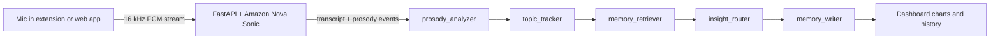

# Debrief

Debrief is a voice-first AI assistant that lives in your browser. You talk through what's on your mind after a coaching session, a hard meeting or a long day, and Debrief listens to how you said it as well as what you said. It tracks pace and pitch against your own baseline, pulls out action items and recurring triggers, and flags the sessions where something shifted.

It also works as a capture tool. Hit a shortcut on any tab, say what you want to do with it, and Debrief logs it to your ledger and tidies the tab away.

This repo holds the agent package, the web app and the Chrome extension. The FastAPI backend lives in [Debrief-Backend](https://github.com/JaegerDanger2022/Debrief-Backend).

## How a session flows

1. Audio streams from the browser to the backend, which holds a two-way Nova Sonic stream per session on AWS Bedrock.
2. The LangGraph session graph tags emotional markers from the prosody events, extracts topics, looks up related past sessions, and asks a Bedrock model for a structured `InsightPayload`: a state-shift summary, acoustic telemetry, action items, triggers and a breakthrough flag.
3. The payload schema is shared across Python (Pydantic), the backend database and the TypeScript front end, so all three stay in sync.
4. A separate **Forget Me** graph purges every record for a user on request.

## What's inside

| Folder | What it is |
| --- | --- |
| `Debrief-LangGraph` | Installable `debrief-agent` package: session, memory and Forget Me graphs, nodes, Postgres and pgvector memory store |
| `Debrief-NextJS` | Next.js dashboard: onboarding with voice calibration, live session with transcript and barge-in, history, ledger, and charts for WPM, pitch stability and emotional shift |
| `debrief-extension` | Chrome extension (Manifest V3): side panel, offscreen audio capture with an AudioWorklet PCM processor, keyboard shortcuts for capture |

## Stack

- **AI:** LangGraph, LangChain, AWS Bedrock (Amazon Nova Sonic for speech, Titan embeddings, a Bedrock text model for insights)
- **Data:** PostgreSQL with pgvector (asyncpg), Pydantic models shared end to end
- **Web:** Next.js, TypeScript, Tailwind, shadcn/ui, Zustand, TanStack Query, Recharts, Framer Motion, Firebase auth
- **Extension:** Chrome MV3, Vite, React, WebSocket audio streaming

## Status

In active development. Semantic search over past sessions in pgvector is the piece still being built.

## Author

Martin Mensah-Solomon, Applied AI Engineer. [Portfolio](https://martins-portfolio.click) and [LinkedIn](https://www.linkedin.com/in/mkmensahsol).
